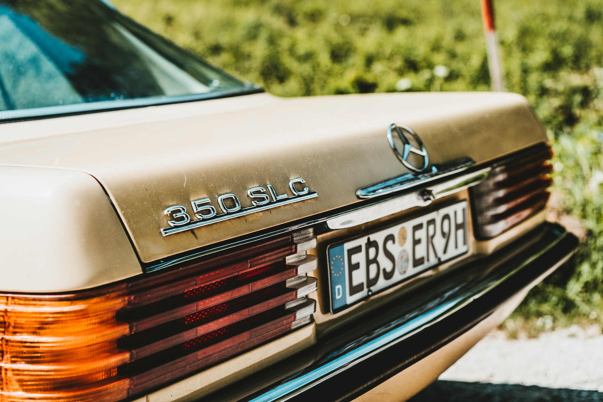

# Car Plates Detector

_Photo by [Tom Grünbauer](https://unsplash.com/@tomgruenbauer?utm_source=unsplash&utm_medium=referral&utm_content=creditCopyText) on [Unsplash](https://unsplash.com/photos/WElrXyQnTiM?utm_source=unsplash&utm_medium=referral&utm_content=creditCopyText)_

This repository contains a car plates detector using **YOLOv8** and **PyTesseract**. It's a powerful and efficient tool for detecting and recognizing license plates in images. The repo includes a Flask application where you can upload an image and the detector will identify the license plate for you.
